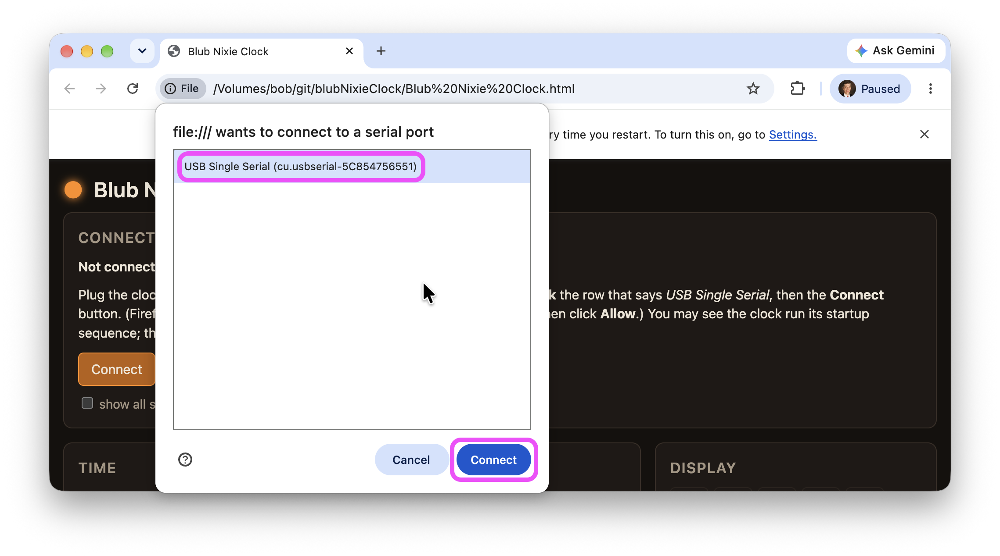
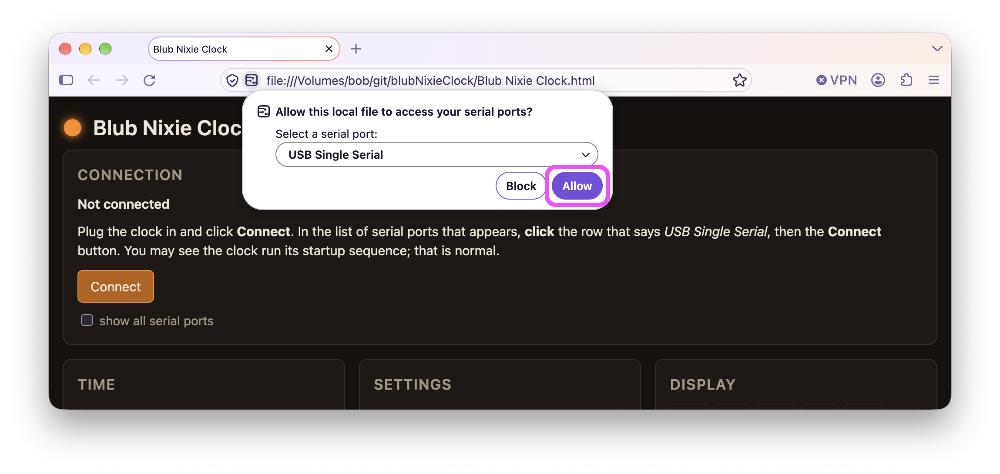

# blubNixieClock

Set up your **[Blub Nixie Clock](https://www.daliborfarny.com/project/blub-nixie-clock/)** by
Dalibor Farný from your computer: set its time exactly from your computer's clock, change its
display speed, brightness, night hours, 12/24-hour format and daylight-saving rule, or show any
digit on the tube.

It runs in your web browser, so there is nothing to download or install, no installer to trust,
and nothing to keep up to date — you always get the current version. It works the same on
Windows, Mac and Linux.

**[Open the app](https://bobvan.github.io/blubNixieClock/)**

## Using it

You need a Windows, Mac or Linux computer with **Google Chrome** (Microsoft Edge and recent
Firefox work too). Safari can't talk to the clock, and neither can phones or tablets. If you
don't have either, download [Chrome](https://www.google.com/chrome/) or
[Firefox](https://www.mozilla.org/firefox/new/) free.

1. **Plug the clock into your computer** with its USB cable.
2. **[Open the app](https://bobvan.github.io/blubNixieClock/) in Chrome.**
3. **Click Connect.**

   

4. **Choose the clock.** In the list of serial ports that appears, click the row that says
   **USB Single Serial**, then the **Connect** button. You may see the clock run its startup
   sequence; that is normal.

   

   Firefox asks in its own way: check that the drop-down says **USB Single Serial**, then
   click **Allow**.

   

5. **That's it.** Set the clock from your computer's time, change its settings, or show a digit.
   Every change is saved in the clock.

   

If you see **No clock found on that port**, click **Select another serial port** and pick
*USB Single Serial*. If it still can't find the clock, another program may be using it: quit
other programs that talk to the clock (such as the vendor's Windows app) and try again.

The vendor's **clear EEPROM** command is deliberately not in the app.

### Using it without the internet

The app also runs from a copy on your own computer:

1. On this page, click the green **Code** button, then **Download ZIP**. Double-click the
   downloaded file to unzip it.
2. In the unzipped folder, right-click **Blub Nixie Clock.html**, choose **Open With**, then
   **Google Chrome**. Then carry on from step 3 above.

   

## How it works

The clock contains an Arduino behind a USB-serial bridge, speaking a small line-oriented
protocol. The app talks to it directly from the browser using the Web Serial API; nothing is
sent anywhere else.

### Protocol

Mapped against real hardware (firmware 1.9) in
[`docs/reference/serial-protocol.md`](docs/reference/serial-protocol.md), including the parts
the vendor page does not document: how to read settings back, what the replies mean, how `t`
treats time zones and DST, and the USB identity.

## Repository layout

- **`Blub Nixie Clock.html`** — the page you open. Everything it loads lives in `web/`.
- **`index.html`** — a redirect so the hosted site's short address opens the app.
- **[`web/`](web/)** — `blub.js` is the protocol layer (no DOM, also loads under Node);
  `app.js` is the Web Serial transport and UI; `style.css` the look.
- **[`test/`](test/)** — `node --test test/blub.test.js` exercises the protocol layer against
  a fake clock that replies with strings captured from the real one.
- **[`docs/`](docs/)** — the durable record: design decisions with reasoning
  ([`docs/design/`](docs/design/)) and reference material ([`docs/reference/`](docs/reference/)).
  See [`docs/README.md`](docs/README.md).

## Design

[`docs/design/0001-gui-platform.md`](docs/design/0001-gui-platform.md): web-first with Chrome's
Web Serial; the protocol layer is kept transport-agnostic so a native shell (Tauri) or a CLI
can reuse it later.

## License

BSD 3-Clause — see [`LICENSE`](LICENSE).
