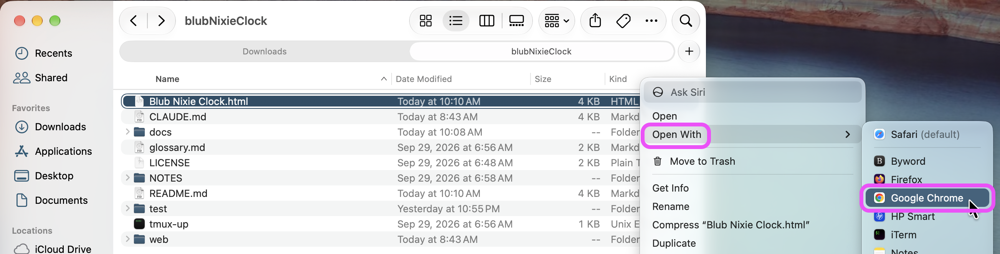
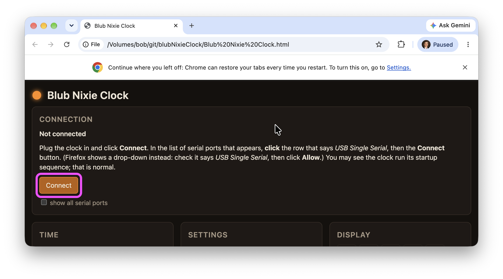
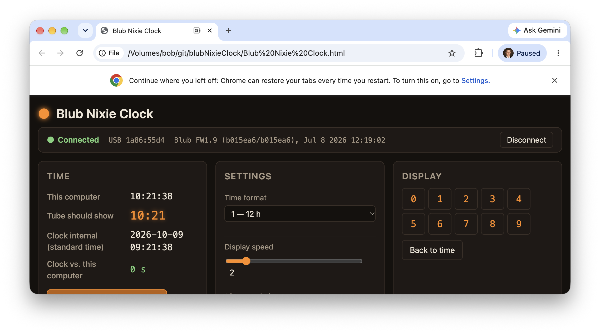
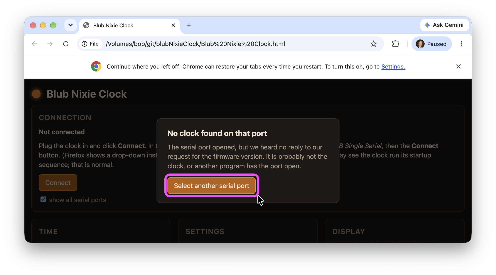

# blubNixieClock

A web GUI for the **[Blub Nixie Clock](https://www.daliborfarny.com/project/blub-nixie-clock/)**
by Dalibor Farný.

The clock contains an Arduino behind a USB-serial bridge, speaking a small line-oriented
protocol. This project talks to it from a browser using the Web Serial API: set the time from
your computer's clock, read and change every setting, and show a digit on the tube.

## Using it

You need a Mac or PC with **Google Chrome** (Microsoft Edge works too). Safari and Firefox
can't talk to the clock, and neither can phones or tablets. If you don't have Chrome,
[download it free from Google](https://www.google.com/chrome/). Nothing else to install.

1. **Get the app.** On this page, click the green **Code** button, then **Download ZIP**.
   Double-click the downloaded file to unzip it.
2. **Plug the clock into your computer** with its USB cable.
3. **Open the app in Chrome.** In the unzipped folder, right-click **Blub Nixie Clock.html**,
   choose **Open With**, then **Google Chrome**.

   

4. **Click Connect.**

   

5. **Choose the clock.** In the list of serial ports that appears, click the row that says
   **USB Single Serial**, then the **Connect** button. You may see the clock run its startup
   sequence; that is normal.

   

6. **That's it.** Set the clock from your computer's time, change its settings, or show a digit.
   Every change is saved in the clock.

   

If you see **No clock found on that port**, click **Select another serial port** and pick
*USB Single Serial*. If it still can't find the clock, another program may be using it: quit
other programs that talk to the clock (such as the vendor's Windows app) and try again.

The vendor's **clear EEPROM** command is deliberately not in the app.

## Protocol

Mapped against real hardware (firmware 1.9) in
[`docs/reference/serial-protocol.md`](docs/reference/serial-protocol.md), including the parts
the vendor page does not document: how to read settings back, what the replies mean, how `t`
treats time zones and DST, and the USB identity.

## Repository layout

- **`Blub Nixie Clock.html`** — the page you open. Everything it loads lives in `web/`.
- **[`web/`](web/)** — `blub.js` is the protocol layer (no DOM, also loads under Node);
  `app.js` is the Web Serial transport and UI; `style.css` the look.
- **[`test/`](test/)** — `node --test test/blub.test.js` exercises the protocol layer against
  a fake clock that replies with strings captured from the real one.
- **[`docs/`](docs/)** — the durable record: design decisions with reasoning
  ([`docs/design/`](docs/design/)) and reference material ([`docs/reference/`](docs/reference/)).
  See [`docs/README.md`](docs/README.md).

## Design

[`docs/design/0001-gui-platform.md`](docs/design/0001-gui-platform.md): web-first with Chrome's
Web Serial; the protocol layer is kept transport-agnostic so a native shell (Tauri) or a CLI
can reuse it later.

## License

BSD 3-Clause — see [`LICENSE`](LICENSE).
